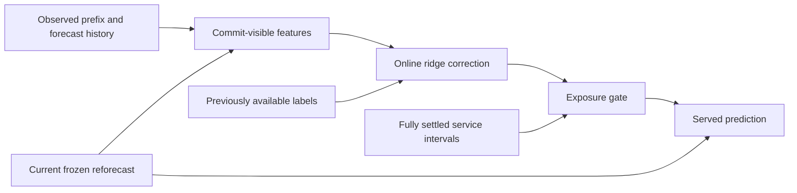

# CommitCast

**Forecast commitment and causal revision for time-series forecasting.**

[Method](#method) | [Installation](#installation) | [Quick start](#quick-start) | [Data and checkpoints](#data-and-checkpoints) | [Evaluation](#evaluation) | [Protocol](docs/protocol.md) | [Experiments](docs/experiments.md)

CommitCast revises forecasts as observations become available during a forecast horizon. At each commitment, it combines a fresh prediction from a frozen forecasting model with an online residual correction. A settled-risk gate controls the correction using feedback from previously served intervals. Each request covers the complete horizon **H**; every target is served and scored once within that request.

This repository contains the CommitCast implementation, forecast export, commitment-based evaluation, and the official TAFAS, PETSA and current COSA implementations used for comparison.

## Method

A request starts at origin `i`. At a later commitment with delay `a`, the current frozen forecast is aligned with the request's remaining targets. CommitCast forms the served prediction as

$$
\widehat{\mathbf{y}}_{i,a}
= \mathbf{b}_{i,a} + \alpha_{i,a}\,\boldsymbol{\Delta}_{i,a},
\qquad 0 \leq \alpha_{i,a} \leq 1,
$$

where `b` is the current frozen reforecast, `Delta` is a clipped ridge correction, and `alpha` is the settled-risk exposure. The prediction is served until the next commitment. The first interval uses the frozen forecast without correction.

The method has three components:

1. **Commit-visible features.** Observed prefix residuals, current forecast geometry and earlier forecasts for the same future targets describe the state at a commitment.
2. **Online ridge correction.** Separate sufficient statistics for each lead and channel estimate the residual of the current reforecast. Updates use only labels available before the decision time; the forecasting model remains frozen.
3. **Settled-risk exposure.** Discounted feedback from fully settled service intervals determines how much of the proposed correction is applied.



The backbone is frozen, but the ridge coefficients and exposure state are learned online. The ridge update block size controls when coefficients change and how update batches are weighted; it is part of the method configuration.

| Feature group | Information | Dimensions |
| --- | --- | ---: |
| Prefix | Mean, latest value and slope of observed prefix residuals | 3 |
| Geometry | Reforecast mean and slope, issue-to-reforecast displacement and local deviations | 5 |
| Forecast history | Dispersion, latest step, curvature and mean gap across same-target forecasts | 4 |

The default `full` configuration uses all 12 features. The `pg`, `p` and `g` ablations use 8, 3 and 5 features, respectively. The numerical estimator is in [layers/online_ridge.py](layers/online_ridge.py); the adapter is in [tta/commitcast.py](tta/commitcast.py). See the [protocol specification](docs/protocol.md) for observation timing, schedules, defaults and metric definitions.

## Installation

Use Python 3.11 or 3.12 in an isolated environment. CommitCast replay supports CPU and CUDA. The bundled official baseline adapters require CUDA.

```bash
python -m venv .venv
```

Activate the environment with `source .venv/bin/activate` on Linux/macOS or `.\.venv\Scripts\Activate.ps1` in PowerShell.

For CPU replay:

```bash
python -m pip install torch==2.10.0 --index-url https://download.pytorch.org/whl/cpu
python -m pip install -e .
```

For baseline experiments, install a CUDA build of PyTorch 2.10.0 compatible with your device, then install the baseline dependencies:

```bash
python -m pip install -e ".[baselines]"
```

Dependency versions and command-line entry points are declared in [pyproject.toml](pyproject.toml). Run the following commands from the repository root. Multi-line examples use Bash syntax.

## Quick start

After preparing a frozen forecast stream as described below, run the default quarter-horizon schedule:

```bash
python scripts/run_schedules.py \
  --stream streams/BASE_ETTh1_DLinear_h96_seed0_batch48/adapter_stream.npz \
  --output results/commitcast_default --device cpu --schedules default
```

The output directory contains `metrics.csv`, `request_metrics.csv` and `run.json`. Use a new output directory for each replay. Datasets, trained checkpoints and generated results are external to the source repository.

## Data and checkpoints

The experiment scripts support:

| Setting | Values |
| --- | --- |
| Datasets | ETTh1, ETTh2, ETTm1, ETTm2, exchange_rate, weather |
| Backbones | DLinear, FreTS, iTransformer, MICN, OLS, PatchTST |
| Forecast horizons | 96, 192, 336, 720 |

Dataset download links are available in [Time-Series-Library](https://github.com/thuml/Time-Series-Library). Arrange CSV files as `data/<dataset>/<dataset>.csv`. For example:

```text
data/
  ETTh1/ETTh1.csv
  exchange_rate/exchange_rate.csv
checkpoints/
  DLinear/ETTh1_96/seed_0/
    checkpoint_best.pth
    config.yaml
```

Keep each checkpoint with the configuration used to train it, including its architecture, context length, split, normalization and seed. Data and checkpoints are external inputs. For a new backbone, follow [training and checkpoint preparation](docs/experiments.md#training-a-backbone).

Export the shared frozen forecasts from a prepared checkpoint:

```bash
python main.py --method cosa --protocol export --cfg configs/cosa.yaml \
  --checkpoint-config checkpoints/DLinear/ETTh1_96/seed_0/config.yaml \
  --output streams/BASE_ETTh1_DLinear_h96_seed0_batch48
```

This produces `adapter_stream.npz` and `metadata.json`. The stream stores `pred` and `true` arrays with shape `[N, H, C]`, plus the observed-input timeline used by Event50. Forecast origins advance by one time step. `--checkpoint-config` transfers the forecasting configuration while retaining the selected method's adaptation settings. See the [stream contract](docs/protocol.md#forecast-streams) for alignment requirements.

## Evaluation

### CommitCast

Run the nine static schedules on their common complete-H request set:

```bash
python scripts/run_schedules.py \
  --stream streams/BASE_ETTh1_DLinear_h96_seed0_batch48/adapter_stream.npz \
  --output results/commitcast --device cuda:0
```

Use `--device cpu` for CPU replay, `--feature-mode pg` for the prefix-and-geometry ablation, or `--schedules default` for the quarter-horizon schedule. The schedules and common request support are defined in the [protocol specification](docs/protocol.md#commitment-schedules).

To apply parameters selected on validation, pass a CommitCast YAML with `--cfg` and optional `TTA.COMMITCAST.KEY VALUE` pairs after `--`. The resolved parameters and, when used, the full Event50 threshold record are saved in `run.json`. Named schedules determine commitment times; see [validation selection](docs/experiments.md#validation-selection).

The YACS entry point supports configuration files and `KEY VALUE` overrides:

```bash
python main.py --cfg configs/pg.yaml \
  STREAM.ROOT streams DEVICE cpu RESULT_DIR results/pg_quarters
```

This entry point runs the configured quarter-horizon schedule by default. Its summary files differ from the multi-schedule runner; the [experiment guide](docs/experiments.md#entry-points-and-outputs) describes both interfaces.

### Baselines

TAFAS, PETSA and COSA use their fixed official execution profiles in this comparison. Their adaptation hyperparameters are not retuned by this repository. Use the same checkpoint and exported Base stream for every method:

```bash
python main.py --method cosa --protocol fcr --profile published --cfg configs/cosa.yaml \
  --checkpoint-config checkpoints/DLinear/ETTh1_96/seed_0/config.yaml \
  --base-stream streams/BASE_ETTh1_DLinear_h96_seed0_batch48/adapter_stream.npz \
  --output results/cosa --schedules all
```

To run another method, change both `--method` and `--cfg`, and use a separate output directory:

| Method | `--method` | `--cfg` | Official source |
| --- | --- | --- | --- |
| TAFAS | `tafas` | `configs/tafas.yaml` | [kimanki/TAFAS](https://github.com/kimanki/TAFAS) |
| PETSA | `petsa` | `configs/petsa.yaml` | [BorealisAI/PETSA](https://github.com/BorealisAI/PETSA) |
| COSA | `cosa` | `configs/cosa.yaml` | [bigbases/COSA_ICLR2026](https://github.com/bigbases/COSA_ICLR2026) |

`--protocol native` executes the official adapter and its original full-window evaluation. `--protocol fcr` preserves the learner's update operations and evaluates its outputs under commitment timing. It reports `current` and `native_revisions` as separate service policies. These policies, native scores and complete-H scores must be identified explicitly in comparisons; see [baseline evaluation](docs/protocol.md#baseline-evaluation).

The adapters are directly available in [tta/tafas.py](tta/tafas.py), [tta/petsa.py](tta/petsa.py) and [tta/cosa.py](tta/cosa.py). They share the forecasting models, layers, data loaders and trainer. Published per-cell TAFAS/PETSA settings are consolidated in [configs/published.json](configs/published.json). PETSA uses the official README's rank, loss-alpha and gate arguments; COSA uses its current official execution script. Keep `--profile published` and the supplied method YAML for this comparison. Optional custom configurations are described separately in [baseline profiles and compatibility](docs/experiments.md#baseline-profiles-and-compatibility).

### Metrics

Each retained request contributes exactly `H * C` target coordinates. The reference is the frozen reforecast at the same commitment, evaluated on the same targets. MSE gain is

$$
\operatorname{Gain}_{\mathrm{MSE}}
=100\left(1-\frac{\sum \mathrm{SSE}_{\mathrm{method}}}
                       {\sum \mathrm{SSE}_{\mathrm{Base}}}\right).
$$

MAE gain uses absolute-error sums. Reports also include request-level losses, tail errors and degradation rates. Pooled gain weights target counts and error scales; accompany it with dataset, backbone, horizon and equal-cell summaries. Full definitions and uncertainty considerations are in [scoring and aggregation](docs/protocol.md#scoring-and-aggregation).

For Event50, validation selection and multiple training seeds, follow the [experiment guide](docs/experiments.md).

## Repository structure

```text
main.py, config.py       entry point and method configuration
trainer.py, predictor.py backbone training and CommitCast evaluation
datasets/               benchmark datasets and chronological forecast streams
models/                 shared forecasting backbones and frozen forecast interface
layers/                 backbone layers, online ridge and settled-risk exposure
tta/                    CommitCast, TAFAS, PETSA and current COSA adapters
fcr/                    commitment replay, baseline timing and scoring
configs/                method profiles and published per-cell settings
scripts/                training, export and evaluation entry points
utils/                  configuration, metrics and runtime helpers
docs/                   protocol and experiment instructions
licenses/               upstream license texts
```

## Acknowledgements and license

The repository organization follows [COSA](https://github.com/bigbases/COSA_ICLR2026) and [TAFAS](https://github.com/kimanki/TAFAS). Baseline components retain attribution to their authors and to Time-Series-Library where provided upstream.

Original CommitCast code is licensed under [MIT](LICENSE). Bundled baseline code and derived observation-clock loops retain their respective upstream licenses. See [THIRD_PARTY.md](THIRD_PARTY.md) for source provenance and license boundaries.
